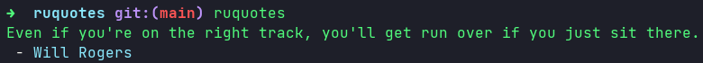

# Ruquotes

[](https://github.com/UltiRequiem/ruquotes/actions/workflows/ci.yaml)
[](https://opensource.org/licenses/MIT)
[](https://github.com/UltiRequiem/ruquotes/blob/main/src/main.rs)

Example CLI tool on Rust that fetches and API, parses JSON and print the output
with colors.

The project also counts with a [ci](./.github/workflows/ci.yaml) and
[release](./.github/workflows/release.yaml) system.



## Installation

With `cargo`:

```sh
cargo install ruquotes
```

Or use a binary from [releases](https://github.com/UltiRequiem/ruquotes/releases/latest).

## License

Licensed under the MIT licence.
